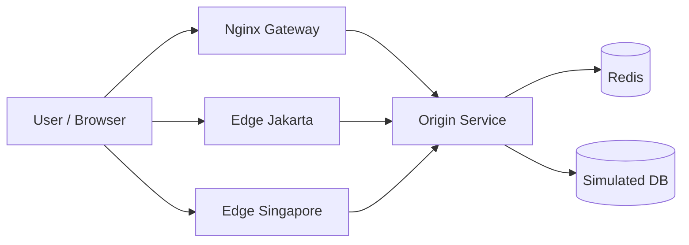

# Demo Dosen - Caching, Redis, Memcached Concept, CDN, Invalidation, Eviction

## 1. Tujuan Demo

Demo ini dibuat untuk menjelaskan bahwa proyek TUGAS 3:

- mengikuti pola pengerjaan TUGAS 1 tetapi tema diganti menjadi caching
- sesuai dengan isi PPT tentang `strategi caching`, `Memcached/Redis concept`, `CDN`, `cache invalidation`, dan `cache eviction`
- memiliki simulasi yang bisa dijalankan di browser dan dibuktikan lagi lewat terminal container
- memperlihatkan perbedaan latency antara request yang `cache miss`, `cache hit`, dan `edge hit`

## 2. Mapping ke PPT

Topik slide yang sudah ter-cover oleh proyek ini:

- `Apa itu caching` -> baseline database vs cache hit
- `Cache Aside` -> skenario local memory dan Redis
- `Write Through` -> tulis ke database dan cache bersamaan
- `Write Back` -> tulis cepat ke buffer dulu, database menyusul
- `Read Through` -> cache loader otomatis saat miss
- `Refresh Ahead` -> refresh hot key sebelum TTL habis
- `Konsep Memcached` -> local memory cache per node
- `Konsep Redis` -> global shared cache berbasis in-memory
- `CDN` -> edge POP Jakarta dan Singapore
- `Invalidation` -> hapus cache saat data sumber berubah
- `Eviction` -> local cache kapasitas kecil dengan efek LRU

## 3. Arsitektur Singkat



Penjelasan komponen:

- `Origin Service` mengendalikan semua skenario cache dan menyimpan status sistem
- `Redis` menjadi contoh cache global bersama
- `Local memory cache` di origin menjadi contoh konsep Memcached-style per node
- `Edge Jakarta` dan `Edge Singapore` menjadi contoh CDN edge cache
- `Dashboard` menampilkan hit rate, latency, cache entries, dan log event

## 4. Skenario Demo yang Disarankan

Urutan aman untuk presentasi dosen:

1. `Tanpa Cache`
2. `Cache Aside - Local Memory`
3. `Cache Aside - Redis`
4. `Read Through`
5. `Write Through`
6. `Write Back`
7. `Refresh Ahead`
8. `Cache Invalidation`
9. `Eviction - LRU`
10. `CDN Edge - Jakarta`
11. `CDN Edge - Singapore`

## 5. Yang Harus Dijelaskan Saat Demo

### Tanpa Cache

Kalimat yang bisa dipakai:

> Pada mode ini semua request langsung ke database. Ini dipakai sebagai baseline agar perbedaan saat cache aktif lebih mudah terlihat.

### Cache Aside - Local Memory

Kalimat yang bisa dipakai:

> Pada request pertama, aplikasi mengalami miss lalu mengambil data dari database. Request berikutnya menjadi lebih cepat karena data sudah ada di local cache. Ini cocok untuk menjelaskan konsep Memcached-style cache per node.

### Cache Aside - Redis

Kalimat yang bisa dipakai:

> Polanya sama, tetapi cache disimpan pada Redis sehingga bisa dibagi oleh beberapa instance aplikasi. Ini cocok untuk sistem yang diskalakan horizontal.

### Read Through

Kalimat yang bisa dipakai:

> Pada read through, aplikasi menganggap cache sebagai satu pintu baca. Saat miss terjadi, cache loader yang otomatis mengambil data dari database lalu menyimpannya.

### Write Through

Kalimat yang bisa dipakai:

> Write Through lebih konsisten karena saat data ditulis, database dan cache diperbarui bersama. Konsekuensinya adalah latency write sedikit lebih tinggi.

### Write Back

Kalimat yang bisa dipakai:

> Write Back lebih cepat di sisi write karena data lebih dulu masuk buffer cache, lalu baru disinkronkan ke database. Ini memperlihatkan trade-off antara performa dan konsistensi eventual.

### Refresh Ahead

Kalimat yang bisa dipakai:

> Refresh Ahead menjaga hot key tetap hangat dengan cara memperbarui cache sebelum TTL habis. Jadi user tetap mendapatkan hit tanpa menunggu miss baru.

### Cache Invalidation

Kalimat yang bisa dipakai:

> Saat data sumber berubah, key cache lama harus dibuang agar user tidak melihat data stale. Ini menjelaskan pentingnya invalidation untuk konsistensi data.

### Eviction - LRU

Kalimat yang bisa dipakai:

> Saat kapasitas cache kecil terisi penuh, item yang paling lama tidak dipakai dikeluarkan lebih dulu. Ini adalah contoh cache eviction policy LRU.

### CDN Edge

Kalimat yang bisa dipakai:

> Request pertama mengambil konten dari origin, lalu konten itu disimpan di edge. Request berikutnya menjadi lebih cepat karena dilayani dari POP yang lebih dekat dengan user.

## 6. Cara Menjalankan

Pastikan Docker Desktop sudah aktif.

```powershell
cd "D:\COLLAGE STUDENT\Semester 6\SCALABLE SYSTEMS DESIGN\TUGAS 3"
docker compose up --build -d
```

Cek container:

```powershell
docker compose ps
```

Buka dashboard:

```text
http://localhost:8080
```

Log container untuk bukti presentasi:

```powershell
docker compose logs -f gateway origin-service edge-jakarta edge-singapore redis
```

Reset stack bila perlu:

```powershell
docker compose down
docker compose up --build -d
```

## 7. Cara Membaca Dashboard

Bagian penting yang bisa Anda tunjuk:

- `Average Latency` = rata-rata response time skenario terakhir
- `Hit Rate` = persentase request yang berhasil dijawab cache
- `Hot Speedup` = seberapa besar peningkatan request panas dibanding cold miss pertama
- `DB Reads` = indikator seberapa besar beban database berhasil dikurangi
- `L1 Local Memory` = menunjukkan cache entries local memory
- `L2 Redis Cache` = menunjukkan cache entries pada Redis
- `Edge POP Snapshot` = menunjukkan hit/miss/asset di CDN edge
- `Log event service` = menunjukkan event teknis yang sinkron dengan terminal

## 8. Screenshot Checklist Untuk Laporan / GitHub

Ambil minimal screenshot berikut:

1. Struktur folder TUGAS 3 di VS Code
2. Dashboard saat pertama dibuka
3. Hasil skenario `Tanpa Cache`
4. Hasil skenario `Cache Aside - Local Memory`
5. Hasil skenario `Cache Aside - Redis`
6. Hasil skenario `Write Through` dan `Write Back`
7. Hasil skenario `Refresh Ahead` atau `Cache Invalidation`
8. Hasil skenario `Eviction - LRU`
9. Hasil skenario `CDN Edge - Jakarta`
10. Terminal `docker compose logs -f ...`
11. Terminal `docker compose ps`
12. Halaman repository GitHub setelah push

## 9. Narasi Presentasi Singkat

> Proyek ini adalah simulasi caching untuk Scalable Systems Design. Pola pengerjaannya mengikuti TUGAS 1, yaitu menggunakan dashboard React dan Docker Compose, tetapi tema dan mekanismenya diganti ke caching. Saya menyiapkan beberapa skenario, yaitu tanpa cache, cache aside local memory, cache aside Redis, read through, write through, write back, refresh ahead, invalidation, eviction LRU, dan CDN edge. Dengan simulasi ini saya bisa menunjukkan perbedaan latency, hit rate, pengurangan beban database, serta perilaku cache lokal, Redis, dan edge cache secara visual di dashboard dan juga secara teknis di terminal log container.

## 10. Pertanyaan Dosen Yang Mungkin Muncul

### "Apa bedanya local cache dan Redis di proyek ini?"

Jawaban:

> Local cache hanya hidup di memory satu service sehingga sangat cepat, tetapi tidak dibagi ke node lain. Redis adalah cache global yang bisa dipakai bersama beberapa instance aplikasi.

### "Apa yang dimaksud cache invalidation?"

Jawaban:

> Invalidation adalah proses menghapus atau memperbarui cache lama saat data sumber berubah supaya user tidak membaca data stale.

### "Apa yang dimaksud cache eviction?"

Jawaban:

> Eviction adalah penghapusan entry cache saat kapasitas penuh agar ada ruang untuk data baru. Di simulasi ini ditunjukkan dengan policy LRU.

### "Kenapa CDN bisa mempercepat?"

Jawaban:

> Karena asset statis disimpan di edge yang lebih dekat ke user, sehingga latency turun dan origin server tidak selalu diminta ulang.

### "Mana yang lebih konsisten: write through atau write back?"

Jawaban:

> Write Through lebih konsisten karena database dan cache diperbarui bersamaan. Write Back lebih cepat, tetapi konsistensinya bersifat eventual.

## 11. Langkah Push ke GitHub

Saat proyek sudah siap dan Anda ingin push:

```powershell
cd "D:\COLLAGE STUDENT\Semester 6\SCALABLE SYSTEMS DESIGN\TUGAS 3"
git init
git add .
git commit -m "Add TUGAS 3 caching observatory simulation"
git branch -M main
git remote add origin <URL-REPO-GITHUB-ANDA>
git push -u origin main
```

Kalau repository GitHub sudah ada tetapi remote belum dipasang, cukup mulai dari `git remote add origin ...`.

## 12. Catatan Penting Sesi Ini

- build frontend sudah berhasil
- validasi sintaks backend sudah berhasil
- `docker compose config` sudah berhasil
- validasi runtime penuh berhasil dilakukan dengan `docker compose up --build -d`
- jika `gateway` gagal start dengan pesan `host not found in upstream "origin-service:3000"`, lakukan restart bersih:

```powershell
docker compose down
docker compose up --build -d
```

Langkah ini akan membuat ulang network Docker dan biasanya langsung memulihkan stack.
