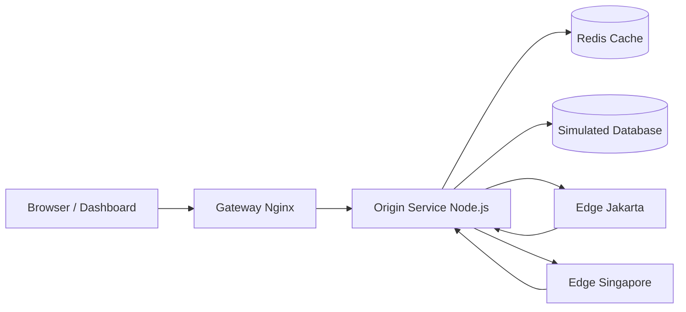

# TUGAS 2 - Caching Observatory
NMA RIFKI NUR FAHREZI AHMAD 105841104723

## Fitur Utama

- simulasi `tanpa cache` sebagai baseline latency database
- simulasi `cache aside` pada local memory untuk menjelaskan konsep Memcached-style cache
- simulasi `cache aside` pada Redis untuk menjelaskan cache global lintas node
- simulasi `read through`, `write through`, `write back`, dan `refresh ahead`
- simulasi `cache invalidation` dan `LRU eviction`
- simulasi `CDN edge` dengan dua POP: Jakarta dan Singapore
- dashboard visual yang menampilkan hit rate, latency, cache entries, edge snapshot, dan event log

## Arsitektur



## Struktur Utama

- `dashboard/` = frontend React + Vite untuk visualisasi simulasi
- `gateway/` = Nginx sebagai reverse proxy untuk dashboard dan API
- `origin-service/` = service Node.js untuk semua skenario cache dan status sistem
- `edge-jakarta/` = simulasi CDN edge untuk region Jakarta
- `edge-singapore/` = simulasi CDN edge untuk region Singapore
- `docker-compose.yml` = orkestrasi seluruh stack

## Menjalankan Proyek

Pastikan Docker Desktop sedang aktif terlebih dahulu.

```powershell
cd "D:\COLLAGE STUDENT\Semester 6\SCALABLE SYSTEMS DESIGN\TUGAS 2"
docker compose up --build -d
```

Dashboard:

```text
http://localhost:8080
```

Mematikan stack:

```powershell
docker compose down
```

## Validasi Lokal Yang Sudah Dilakukan

- `docker compose config` berhasil
- `node --check` untuk service backend berhasil
- `npm.cmd run build` untuk dashboard berhasil

Catatan:

- validasi `docker compose up --build -d` belum bisa dijalankan penuh pada sesi ini karena Docker daemon lokal belum aktif

## Panduan Presentasi

Lihat file `DEMO-DOSEN-CACHING.md` untuk skenario demo, narasi presentasi, screenshot checklist, dan langkah push GitHub.
