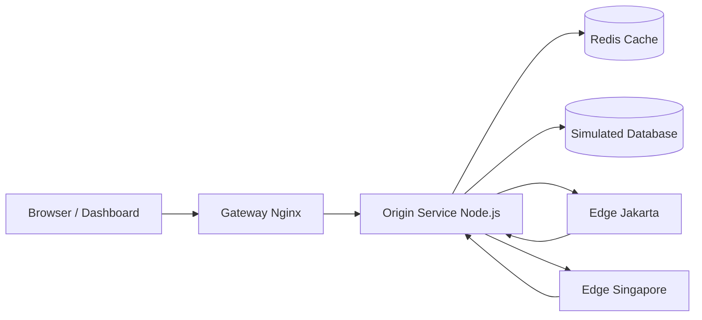

# TUGAS 3 - Caching Observatory
 RIFKI NUR FAHREZI AHMAD 105841104723

## Fitur Utama

- simulasi `tanpa cache` sebagai baseline latency database
- simulasi `cache aside` pada local memory untuk menjelaskan konsep Memcached-style cache
- simulasi `cache aside` pada Redis untuk menjelaskan cache global lintas node
- simulasi `read through`, `write through`, `write back`, dan `refresh ahead`
- simulasi `cache invalidation` dan `LRU eviction`
- simulasi `CDN edge` dengan dua POP: Jakarta dan Singapore
- dashboard visual yang menampilkan hit rate, latency, cache entries, edge snapshot, dan event log

## Arsitektur

 
