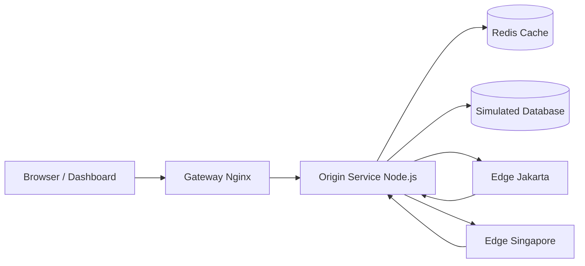

# TUGAS 3 - Caching Observatory

## Identitas Mahasiswa

Nama: RIFKI NUR FAHREZI AHMAD  
NIM: 105841104723

## Deskripsi Singkat

Tugas 3 ini adalah simulasi caching dan CDN untuk mata kuliah Scalable Systems Design. Proyek ini menggunakan dashboard React untuk visualisasi dan Docker Compose untuk menjalankan seluruh komponen sistem. Fokus utamanya adalah menunjukkan bagaimana strategi cache yang berbeda memengaruhi latency, hit rate, beban database, dan pengalaman user.

Maksud utama dari proyek ini adalah memperlihatkan bahwa caching bukan hanya teori, tetapi benar-benar mengubah perilaku sistem ketika request dibaca berulang, saat data ditulis, dan saat konten dilayani dari edge yang lebih dekat ke user.

## Dokumentasi Tampilan Aplikasi

Bagian ini berisi screenshot hasil implementasi dashboard. Setiap gambar dipakai untuk menjelaskan arti dari skenario caching yang disimulasikan.

### 1. Baseline Tanpa Cache

<p align="center">
    
</p>

Screenshot ini memperlihatkan kondisi dasar saat seluruh request masih menuju database secara langsung tanpa bantuan cache.

Yang terlihat dari tampilan ini:

- `Average Latency` masih tinggi
- `Hit Rate` masih `0.0%`
- `DB Reads` masih besar
- semua request pada timeline dilayani oleh `Database`

Maksud dari tampilan ini adalah memberikan baseline pembanding. Dengan baseline ini, dosen atau pembaca dapat melihat perbedaan yang jelas ketika strategi cache lain mulai diaktifkan.

### 2. Cache Aside - Local Memory

<p align="center">
    
</p>

Screenshot ini menunjukkan hasil strategi cache lokal di memory aplikasi.

Yang dapat diamati:

- request pertama masih `miss` dan mengambil data dari database
- request berikutnya menjadi jauh lebih cepat
- `Hit Rate` naik signifikan
- `DB Reads` turun karena data sudah tersedia di local cache

Maksud dari tampilan ini adalah menjelaskan konsep cache lokal per-node, mirip pendekatan Memcached-style. Strategi ini sangat cepat, tetapi cache hanya tersedia di instance aplikasi yang sama.

### 3. Read Through

<p align="center">
    
</p>

Screenshot ini memperlihatkan skenario `Read Through`.

Pada skenario ini:

- aplikasi membaca data melalui cache sebagai pintu utama
- saat miss terjadi, cache loader mengambil data dari database
- request berikutnya dilayani cache secara otomatis
- latency turun setelah miss pertama

Maksud dari tampilan ini adalah menunjukkan bahwa aplikasi dapat menyederhanakan pola baca, karena cache menjadi lapisan baca utama dan database hanya disentuh saat data belum tersedia di cache.

### 4. Write Through

<p align="center">
    
</p>

Screenshot ini menunjukkan skenario `Write Through`.

Yang terlihat:

- write pertama lebih lambat karena database dan cache diperbarui bersama
- read berikutnya menjadi cepat karena data terbaru sudah ada di Redis
- `Hit Rate` tetap tinggi setelah write selesai

Maksud dari tampilan ini adalah menjelaskan trade-off `Write Through`: konsistensi lebih baik karena cache dan database diperbarui bersamaan, tetapi latency write menjadi sedikit lebih tinggi.

### 5. CDN Edge - Jakarta

<p align="center">
    
</p>

Screenshot ini memperlihatkan simulasi `CDN Edge - Jakarta`.

Yang dapat dibaca dari tampilan ini:

- request pertama masih mengambil aset dari origin
- request berikutnya dilayani oleh edge Jakarta
- latency menjadi jauh lebih rendah dibanding cold miss pertama
- beban origin berkurang setelah konten tersimpan di edge

Maksud dari tampilan ini adalah menunjukkan manfaat edge cache yang dekat dengan user. Setelah konten tersimpan di POP Jakarta, request berikutnya tidak perlu selalu kembali ke origin.

### 6. CDN Edge - Singapore

<p align="center">
    
</p>

Screenshot ini memperlihatkan simulasi `CDN Edge - Singapore`.

Yang terlihat:

- pola kerjanya sama dengan edge Jakarta
- request awal mengambil aset dari origin
- request selanjutnya dilayani dari edge Singapore
- latency edge Singapore tetap lebih cepat daripada cold miss, tetapi berbeda dari Jakarta karena profil latensinya berbeda

Maksud dari tampilan ini adalah menjelaskan bahwa edge cache juga dipengaruhi lokasi region. Semakin dekat edge dengan user, semakin baik pengalaman akses yang bisa diberikan.

## Fitur Utama

- simulasi `tanpa cache` sebagai baseline database
- simulasi `cache aside` pada local memory
- simulasi `cache aside` pada Redis
- simulasi `read through`
- simulasi `write through`
- simulasi `write back`
- simulasi `refresh ahead`
- simulasi `cache invalidation`
- simulasi `LRU eviction`
- simulasi `CDN Edge` untuk region Jakarta dan Singapore
- dashboard visual untuk membaca hit rate, latency, DB reads, edge behavior, dan timeline request

## Arsitektur Sistem



### Penjelasan Arsitektur

1. User membuka dashboard di browser.
2. Dashboard berkomunikasi melalui gateway `Nginx`.
3. `Origin Service` menjalankan seluruh logika simulasi cache dan menyimpan state sistem.
4. `Redis` dipakai sebagai cache global bersama.
5. `Simulated Database` menjadi sumber data baseline tanpa cache.
6. `Edge Jakarta` dan `Edge Singapore` mensimulasikan CDN POP untuk dua region berbeda.

## Struktur Folder

- `dashboard/` berisi frontend React + Vite untuk visualisasi simulasi.
- `gateway/` berisi reverse proxy Nginx untuk dashboard dan API.
- `origin-service/` berisi service Node.js untuk seluruh strategi cache.
- `edge-jakarta/` berisi simulasi edge cache untuk Jakarta.
- `edge-singapore/` berisi simulasi edge cache untuk Singapore.
- `docker-compose.yml` berisi orkestrasi stack.
- `SS/` berisi screenshot dokumentasi hasil implementasi.
- `DEMO-DOSEN-CACHING.md` berisi panduan narasi demo dan presentasi.

## Cara Menjalankan

Pastikan Docker Desktop sudah aktif terlebih dahulu.

```powershell
cd "D:\COLLAGE STUDENT\Semester 6\SCALABLE SYSTEMS DESIGN\TUGAS 3"
docker compose up --build -d
```

Dashboard dapat dibuka di:

```text
http://localhost:8080
```

Untuk menghentikan stack:

```powershell
docker compose down
```

Untuk melihat log container:

```powershell
docker compose logs -f gateway origin-service edge-jakarta edge-singapore redis
```

## Endpoint Penting

- `http://localhost:8080/` untuk dashboard
- `http://localhost:8080/healthz` untuk health gateway
- `http://localhost:8080/api/status` untuk status sistem cache dan edge

## Alur Presentasi Singkat

Urutan demo yang aman untuk dosen:

1. tampilkan `Tanpa Cache` sebagai baseline
2. lanjut ke `Cache Aside - Local Memory`
3. bandingkan dengan `Read Through`
4. tampilkan `Write Through` untuk menjelaskan trade-off write
5. tampilkan `CDN Edge - Jakarta`
6. tampilkan `CDN Edge - Singapore`

Maksud dari urutan ini adalah agar dosen melihat transisi yang jelas dari sistem tanpa cache, ke cache lokal, ke cache global, sampai ke edge cache regional.

## Validasi Lokal yang Sudah Dilakukan

- `docker compose config` berhasil
- `docker compose up --build -d` berhasil
- gateway berhasil diakses di `http://localhost:8080`
- endpoint `healthz` berhasil merespons
- endpoint `api/status` berhasil merespons
- seluruh service `gateway`, `origin-service`, `redis`, `edge-jakarta`, dan `edge-singapore` dapat dijalankan kembali setelah restart bersih stack

## Kesimpulan

Tugas 3 ini menunjukkan implementasi caching observatory yang tidak hanya menjelaskan konsep cache secara teori, tetapi juga memperlihatkan dampaknya terhadap latency, hit rate, pengurangan beban database, dan distribusi konten ke edge cache. Dengan dashboard visual dan orkestrasi Docker, proyek ini sangat cocok dipakai untuk menjelaskan strategi caching secara lebih praktis dan terukur.
